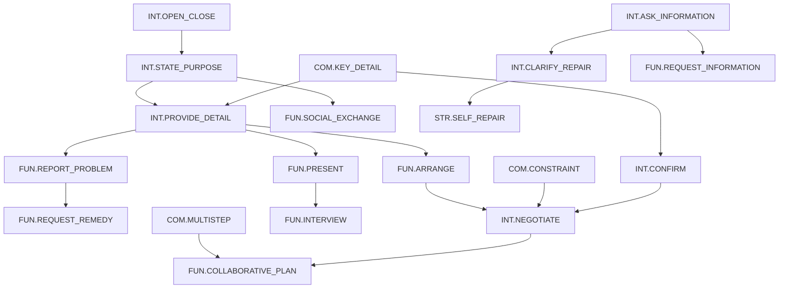

# Marzi Learning Competency, Curriculum, and Mastery Model

**Contract:** `marzi.learning.v1`

**Status:** ENCODED as `docs/learning/contracts/v1` under Product Owner
approval of 2026-08-03 — learning-specialist approval still required

**Runtime effect:** None

**Applies initially to:** German live pack and English pilot pack

## 1. Purpose

This contract defines the learning language shared by content, future
evaluation, placement, recommendations, and later reward inputs. It answers:

- what capability a scenario gives the learner an opportunity to demonstrate;
- which observations count as evidence;
- how participation, completion, mastery, and review differ;
- what the product may say when evidence is insufficient; and
- how assistance changes the interpretation of evidence without punishing
  accessibility use.

It does not change the current app. It does not select XP values, coin values,
reward eligibility, anti-farming thresholds, pronunciation scoring, prompts,
providers, or storage retention.

## 2. Design constraints

The model follows these canonical constraints:

1. The target-language axis is independent of interface and explanation
   languages.
2. Scenario and character identities are frozen.
3. `ConversationSession` remains the canonical ordered-utterance owner.
4. Exact recognized learner speech is immutable; corrections are annotations.
5. XP, rank, coins, Marzi evolution, participation, completion, and mastery are
   separate concepts.
6. No pronunciation or fluency claim is valid without appropriate acoustic
   evidence. Speech-recognition text is not acoustic evidence.
7. “Not enough evidence” is a normal, truthful outcome.
8. Accessibility accommodation is never treated as cheating or weak learning.
9. Objective evidence references canonical utterance or response IDs; it never
   duplicates the transcript as another source of truth.
10. Free-form AI judgments are advisory until validated into the typed evidence
    contract with traceable source observations.

## 3. Curriculum layers

Marzi uses four layers. They must not be collapsed into a single score.

| Layer | Question | Stable identifier example |
|---|---|---|
| Competency | What reusable ability is being developed? | `INT.STATE_PURPOSE` |
| Scenario objective | What real-world outcome should the learner achieve here? | `de.arzt.book_appointment` |
| Opportunity | What event gave the learner a fair chance to demonstrate it? | `opp-<stable-id>` |
| Evidence observation | What did the learner actually do, with what support? | `ev-<stable-id>` |

Scenario objectives map to one or more competencies. A learner can complete an
objective without proving broad mastery, and can demonstrate a competency even
when the overall scenario remains incomplete.

## 4. Proposed competency taxonomy

The IDs below are language-neutral and immutable after approval. Learner-facing
names and explanations are localized; IDs are never shown as UI copy.

### 4.1 Comprehension (`COM`)

| ID | Observable capability |
|---|---|
| `COM.KEY_DETAIL` | Identifies an essential fact, question, offer, or requested detail and responds consistently with it. |
| `COM.CONSTRAINT` | Understands a limitation, condition, refusal, alternative, date, amount, or other constraint. |
| `COM.MULTISTEP` | Follows connected information or more than one required action without losing the task. |

### 4.2 Interaction management (`INT`)

| ID | Observable capability |
|---|---|
| `INT.OPEN_CLOSE` | Opens and closes an exchange appropriately for channel and register. |
| `INT.STATE_PURPOSE` | Makes the reason for the interaction understandable. |
| `INT.PROVIDE_DETAIL` | Supplies relevant personal, temporal, quantitative, descriptive, or contextual information. |
| `INT.ASK_INFORMATION` | Requests information needed to continue or decide. |
| `INT.CLARIFY_REPAIR` | Signals non-understanding, asks for repetition/clarification, or repairs a misunderstanding. |
| `INT.CONFIRM` | Confirms, checks, accepts, or rejects a detail or proposed outcome. |
| `INT.NEGOTIATE` | Responds to a constraint with an alternative, counter-proposal, compromise, or justified preference. |

### 4.3 Functional outcomes (`FUN`)

| ID | Observable capability |
|---|---|
| `FUN.ARRANGE` | Creates, changes, cancels, or confirms an appointment, reservation, delivery, or other arrangement. |
| `FUN.REQUEST_INFORMATION` | Obtains practical information, requirements, status, cost, location, schedule, or next steps. |
| `FUN.REPORT_PROBLEM` | Describes a problem with enough relevant information for the other party to act. |
| `FUN.REQUEST_REMEDY` | Requests and reaches a repair, replacement, refund, escalation, or other remedy. |
| `FUN.TRANSACT` | Selects, orders, buys, exchanges, or returns a product/service while resolving required details. |
| `FUN.SOCIAL_EXCHANGE` | Sustains appropriate small talk, invitation, apology, request, boundary, or social relationship work. |
| `FUN.PRESENT` | Gives a coherent account of self, experience, plans, or a familiar topic and handles follow-up. |
| `FUN.COLLABORATIVE_PLAN` | Co-creates a plan by proposing, responding, agreeing, and confirming responsibilities/details. |
| `FUN.INTERVIEW` | Presents relevant experience, answers role questions, and obtains employment-process information. |

### 4.4 Sociolinguistic and language control (`SOC`, `LNG`)

| ID | Observable capability |
|---|---|
| `SOC.REGISTER` | Uses an understandable degree of politeness, directness, address, and channel convention. |
| `LNG.LEXICAL_FIT` | Selects vocabulary sufficient and appropriate for the intended meaning. |
| `LNG.GRAMMATICAL_CONTROL` | Forms language accurately enough for the intended meaning at the claimed band. |
| `LNG.COHERENCE` | Connects information so the exchange or presentation remains followable. |

### 4.5 Learning strategy (`STR`)

| ID | Observable capability |
|---|---|
| `STR.SELF_REPAIR` | Notices and repairs or reformulates the learner's own contribution. |
| `STR.INDEPENDENT_RETRIEVAL` | Produces useful language without copying a complete supplied answer. |

`STR.INDEPENDENT_RETRIEVAL` records the support context of evidence. It must not
penalize screen readers, alternative input, extra time, or another approved
accessibility accommodation.

## 5. Internal learning bands

The existing runtime order is retained: `A0`, `A1`, `A2`, `B1`, `B2`, `C1`.
`A0` is Marzi's internal pre-A1 label, not an additional CEFR certification.
The following descriptors are proposed curriculum boundaries and require
learning-specialist approval:

| Band | Opportunity design and expected demonstration |
|---|---|
| A0 | Supported recognition and very short fixed or chosen chunks; one concrete purpose/detail at a time. |
| A1 | Simple predictable one-step exchange using familiar words and short clauses. |
| A2 | Routine multi-turn exchange, basic reasons/details, and simple repair or alternatives. |
| B1 | Connected explanation and handling of a realistic complication or negotiation. |
| B2 | Flexible, detailed interaction under multiple constraints with appropriate register and repair. |
| C1 | Precise, efficient, nuanced interaction with implicit meaning, complex constraints, and sustained coherence. |

A level setting changes opportunity difficulty; it does not by itself prove a
learner's level. A scenario can offer objectives across several bands, and an
objective declares a supported level interval rather than duplicating six
unrelated versions.

## 6. Prerequisite graph

The proposed graph guides recommendations and review sequencing. It is a DAG,
not a hard lock on scenario access.



Content may declare additional objective-level prerequisites only when both IDs
exist and the full graph remains acyclic. Recommendations may prefer a
prerequisite; they may not make existing scenarios inaccessible without a
separate approved product decision.

## 7. Evidence contract

### 7.1 Opportunity

An opportunity is valid only when the learner could reasonably respond. It
records:

- stable opportunity ID;
- session/attempt ID;
- target language, scenario ID, objective ID, and competency ID;
- source utterance/interaction ID that created the opportunity;
- expected evidence type and supported level band;
- timestamp/order and whether the opportunity was superseded or interrupted.

Provider failure, cancellation, an inaudible system state, or a prompt that
never reached the learner cannot produce a failed learning observation.

### 7.2 Observation outcomes

| Outcome | Meaning |
|---|---|
| `demonstrated` | The response provides the required observable evidence. |
| `partially_demonstrated` | Relevant evidence exists but one or more material criteria are missing. |
| `not_demonstrated` | A fair opportunity and assessable response exist, but the criterion was not demonstrated. |
| `not_observed` | No assessable response was produced for that opportunity. |
| `insufficient_evidence` | Available information cannot support the judgment. |
| `invalid` | The observation is malformed, duplicated, stale, cross-session, or otherwise unusable. |

Every judgment must cite the relevant canonical response/utterance IDs and the
rubric version. A generated explanation is not the evidence itself.

### 7.3 Valid evidence modalities for v1

- canonical transcript text from learner and remote utterances;
- typed learner response where that is the offered equitable path;
- deterministic selection/confirmation events tied to an opportunity;
- declared assistance observations; and
- task outcome/state explicitly produced under the approved completion policy.

Raw audio, inferred accent, speech timing, device confidence, and speech-
recognition confidence are excluded from v1 mastery. A later pronunciation
package may add a separately consented acoustic evidence type only after
MARZI-D019 and privacy review.

## 8. Assistance-sensitive evidence

Each assessable response records the assistance context at the moment of the
response:

- mode: `OFF`, `HINT`, or `FULL`;
- whether assistance was exposed, opened, or changed;
- stable ID of the help item shown, if any;
- whether the learner response is textually identical or materially derived,
  when that comparison is technically valid;
- accessibility accommodation separately from learning assistance; and
- evaluator confidence when derivation cannot be established.

Rules:

1. Merely having a mode enabled does not prove the learner used it.
2. `FULL` support may demonstrate participation and objective completion under
   an approved policy, but cannot alone demonstrate independent retrieval.
3. `HINT` evidence may contribute to developing competence, with the actual
   help recorded.
4. `OFF` does not guarantee independence if the response was supplied by
   another route.
5. Accessibility tools and approved alternative input are not learning help.
6. Toggling help never creates a transcript utterance or a second AI request.
7. Assistance usage may become a reward input only in MARZI-043 after explicit
   economy and privacy approval.

This contract does not choose the default or persistence scope for assistance;
MARZI-D011 governs that later product decision.

## 9. Participation, meaningful attempt, and completion

### 9.1 Participation

Participation exists when at least one valid learner contribution is accepted
into the canonical interaction. It says nothing about objective success.

### 9.2 Meaningful learning attempt

A meaningful learning attempt requires all of:

- an identified scenario objective;
- at least one valid opportunity tied to that objective;
- at least one assessable learner response to that opportunity; and
- a terminal result that is not `invalid`.

This is a pedagogical evidence definition, not the numeric “minimum meaningful
call” reward policy governed by MARZI-D015. It deliberately sets no turn count,
duration, XP, or coin rule.

### 9.3 Objective and scenario completion

MARZI-D016 option A is **approved and recorded**: explicit objective and
terminal criteria with separate partial progress. Accordingly:

- an objective is `complete` only when all objective fields marked `required`
  have a valid terminal observation meeting their rubric;
- it is `partial` when valid evidence supports at least one required criterion
  but not the full terminal contract;
- it is `not_complete` when fair evidence contradicts required criteria;
- it is `insufficient_evidence` when no truthful completion judgment is
  possible; and
- the scenario result is calculated from declared required objectives, not
  from hang-up, elapsed time, reward success, or visit count.

These semantics are encoded in `contracts/v1/completion.json` and enforced by
`test/learning-contracts.js`. The current `scenariosDone` behavior remains
unchanged and must not be relabelled as learning mastery. The per-variant
rubrics that decide whether a criterion was met remain pending specialist
review.

## 10. Mastery and confidence

Mastery aggregates valid competency evidence across distinct opportunities and
attempts. It never reads XP, coins, rank, Marzi stage, time spent, or scenario
visit count as proof.

### 10.1 Mastery presentation states

| State | Meaning |
|---|---|
| `not_enough_evidence` | Too little valid evidence to make a claim. |
| `emerging` | Some demonstrated evidence exists, but it is limited, inconsistent, or highly supported. |
| `developing` | Repeated evidence exists with material gaps or support dependence. |
| `secure` | Repeated, sufficiently independent, current evidence meets the approved rubric across relevant contexts. |
| `review_due` | Previously supported capability should be checked again because evidence is old, recently weak, or context-limited. |

### 10.2 Confidence dimensions

Confidence is an explainable record, not a single opaque probability. It
contains:

- number of distinct valid opportunities and attempts;
- consistency of observations;
- range of scenarios/contexts and level bands;
- assistance profile;
- recency and evidence version;
- evaluator/rubric validity; and
- contradicting evidence.

Numeric minimums, recency windows, aggregation weights, and the learner-facing
label set require Product Owner and learning-specialist approval. They must be
policy data with boundary fixtures, never scattered magic numbers.

## 11. Placement model boundary

MARZI-D009 option A is **approved and recorded**: an optional, skippable,
bounded calibration using vocabulary, comprehension, and listening, with speech
only after explanation and consent. The boundary is encoded in
`contracts/v1/placement.json`; the calibration content itself is an open gate.

The placement result must:

- be provisional and explain its evidence/confidence;
- support “not enough evidence” and a learner-selected starting point;
- preserve separate competency evidence rather than fabricating one exact CEFR
  truth from a few items;
- provide a non-audio route and extended-time usability;
- never request microphone access before explaining value and alternatives;
- permit later recalibration without deleting learning history; and
- use target-specific validated content and localized instructions.

No placement runtime, scoring constants, persistence, onboarding step, or
reward is authorized. `contracts/v1/placement.json` records the boundary only.

## 12. Review rules

Review candidates are generated from learning evidence, not popularity alone.
A competency/objective may become review-relevant when:

- recent evidence is `not_demonstrated` or `partially_demonstrated`;
- evidence is limited to one context or heavily supported responses;
- a prerequisite weakness affects a later objective;
- previously secure evidence is outside the approved recency policy; or
- the learner explicitly asks to review it.

Prioritization must remain explainable, avoid repeating the same scenario when
another context can test transfer, and never remove earned XP. Connectivity
failure, provider failure, missing microphone permission, or accessibility
alternative use cannot create a negative learning observation.

## 13. Ownership and dependency direction

The intended dependency direction is:

```text
ConversationSession / offered interaction
  -> immutable opportunity and response references
  -> learning evidence evaluator
  -> objective result
  -> competency aggregation / review recommendation
  -> presentation adapters

objective result + approved economy policy
  -> reward calculation (later MARZI-043 only)
```

The learning model never writes transcript history, calls providers directly,
owns reward state, or mutates UI navigation. MARZI-022 formalizes event and
ownership boundaries before runtime integration.

## 14. Privacy, retention, and accessibility

- Static curriculum contracts contain no learner data.
- Learning evidence stores references and minimum derived observations; it does
  not duplicate raw transcript text unless a later approved retention contract
  requires it.
- Raw audio is excluded.
- Retention, deletion, analytics, cloud sync, and research use remain governed
  by MARZI-D021, D022, and D024.
- Every assessment claim has an equitable non-speech route where speech is not
  the learning construct being assessed.
- Learner-facing states are expressed in text and semantics, never color alone.
- Objective and progress explanations support six interface/explanation
  languages, RTL, long strings, increased font size, and screen readers.

## 15. Required validation before approval

1. Learning specialist reviews every competency definition and band boundary.
2. Product Owner records MARZI-D009 and MARZI-D016 choices.
3. Product Owner approves objective scope, completion semantics, and mastery
   presentation.
4. Every production scenario and goal variant maps to a stable objective.
5. Unknown competency/objective IDs, cycles, invalid levels, duplicate IDs,
   and malformed evidence fail deterministic fixtures.
6. Negative fixtures prove no mastery from XP, time, visit count, hang-up,
   reward claim, or transcript text without an offered opportunity.
7. Pronunciation evidence is rejected from v1.
8. A moderated small-Android review confirms that localized objective and
   progress language is understandable without relying on color.

## 16. Explicit unresolved items

Resolved on 2026-08-03 and encoded in `contracts/v1`:

- MARZI-D009 placement policy — option A approved.
- MARZI-D016 completion definition — option A approved.
- Taxonomy, objective families, stable identifiers, mastery presentation
  states, and objective-based completion copy — approved in principle for
  static contract authoring.

Still unresolved:

- **LEARNING SPECIALIST REQUIRED:** taxonomy, the 94 variant mappings, bands,
  rubrics, aggregation policy, placement content, and validation fixtures. No
  specialist is named. See `SPECIALIST_REVIEW.md`.
- **LINGUISTIC REVIEW REQUIRED:** the 564 localized objective titles and the
  60 localized completion and mastery strings.
- **ACCESSIBILITY REVIEW REQUIRED:** wording comprehension, screen-reader
  phrasing, and non-colour semantics.
- **PRODUCT OWNER NUMERIC DECISION REQUIRED:** mastery thresholds
  (`MARZI-021-MASTERY-THRESHOLDS`) and the review recency window
  (`MARZI-021-REVIEW-RECENCY`). No default was invented for either.
- **PRODUCT OWNER DECISION REQUIRED:** whether competencies are ever surfaced
  to learners, and their localized labels if so
  (`MARZI-021-COMPETENCY-COPY`).
- **TECHNICAL DISCOVERY REQUIRED:** integration event shape and ownership in
  MARZI-022.
- **LEGAL/PRIVACY REVIEW REQUIRED:** any persisted learner-evidence retention,
  analytics, sync, research, or future acoustic evidence.
